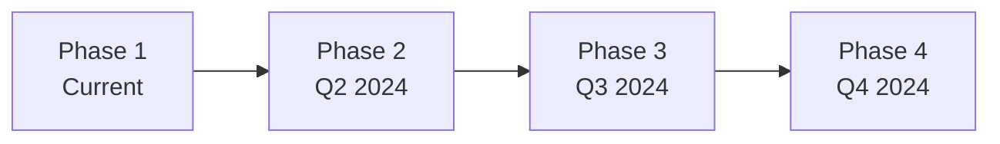

# ESGChain 🌍⛓️

> Blockchain-powered ESG data verification platform for transparent and immutable environmental reporting

<div align="center">

[](https://opensource.org/licenses/MIT)
[](https://mumbai.polygonscan.com/)
[](https://reactjs.org/)
[](https://soliditylang.org/)

</div>

## 🎯 Problem Statement

**68% of companies exaggerate their ESG claims**, leading to widespread greenwashing and loss of consumer trust. 

Traditional ESG reporting suffers from:
- ❌ Lack of transparency
- ❌ Easy manipulation
- ❌ No independent verification

---

## 💡 Solution

ESGChain leverages blockchain technology to create an **immutable, transparent, and publicly verifiable** ESG data platform. 

Every environmental claim is:
- ✅ Cryptographically secured
- ✅ Verifiable by anyone, anywhere
- ✅ Permanently stored on blockchain

---

## ✨ Key Features

<table>
<tr>
<td width="50%">

### 🔐 Blockchain Verification
- Immutable data storage on Polygon
- Cryptographic proof of authenticity
- Transparent transaction history

### 📱 QR Code Verification
- Instant smartphone verification
- No technical knowledge required
- Shareable public verification links

### 🏆 NFT Achievement Certificates
- Mint NFT certificates for ESG milestones
- Tiered achievement system (Bronze → Platinum)
- Tradeable on OpenSea

</td>
<td width="50%">

### 🔗 Supply Chain Transparency
- End-to-end supply chain tracking
- Interactive flow visualization
- Blockchain-verified at each step

### 🌍 Live Carbon Intensity Data
- Real-time grid carbon intensity
- Country-specific energy mix
- Data-driven decision making

### 📄 PDF Certificates
- Professional certificate generation
- Downloadable and shareable
- Includes blockchain proof

</td>
</tr>
</table>

### 🔓 Public Verification
- No wallet required for verification
- Accessible to all stakeholders
- Removes Web3 barriers

---


## 🚀 Quick Start

### Prerequisites

```
Node.js 18+
MetaMask browser extension
Git
```

### Installation

```bash
# Clone the repository
git clone https://github.com/sweeyamsrmap/sweeyam_team29.git
cd sweeyam_team29

# Run setup script
# Windows:
setup.bat

# Mac/Linux:
chmod +x setup.sh
./setup.sh

# Or manually:
npm install
cp .env.example .env
npm run dev
```

🌐 Visit `http://localhost:5173` to see the app.

---


## 📋 Smart Contract Deployment

### Quick Deploy with Remix (5 minutes)

1. **Open Remix IDE**  
   👉 https://remix.ethereum.org/

2. **Create Contract**
   - New file: `ESGChainWithNFT.sol`
   - Copy code from `contracts/ESGChainWithNFT.sol`

3. **Compile**
   - Solidity version: 0.8.19
   - Click "Compile"

4. **Deploy**
   - Environment: "Injected Provider - MetaMask"
   - Network: Polygon Mumbai
   - Click "Deploy" → Confirm in MetaMask

5. **Update Config**
   - Copy contract address
   - Update `.env`: `VITE_CONTRACT_ADDRESS=0xYourAddress`
   - Restart dev server

### Get Test MATIC

🚰 Visit: https://faucet.polygon.technology/
- Select "Mumbai" network
- Enter your wallet address
- Receive free test MATIC

---

## 🏗️ Project Structure

```
esgchain-dashboard/
├── contracts/
│   ├── ESGChain.sol              # Basic smart contract
│   └── ESGChainWithNFT.sol       # Enhanced contract with NFTs
├── src/
│   ├── components/
│   │   ├── BlockchainProof.jsx   # Proof display with QR
│   │   ├── NFTCertificate.jsx    # NFT minting component
│   │   ├── QRCodeDisplay.jsx     # QR code generator
│   │   ├── CarbonIntensityWidget.jsx
│   │   └── ...
│   ├── pages/
│   │   ├── Dashboard.jsx         # Main dashboard
│   │   ├── PublicVerification.jsx # Public verify page
│   │   ├── SupplyChainMap.jsx    # Supply chain tracking
│   │   └── ...
│   ├── utils/
│   │   ├── blockchain.js         # Blockchain interactions
│   │   ├── pdfGenerator.js       # PDF certificate gen
│   │   ├── carbonIntensity.js    # Carbon API integration
│   │   └── mockBlockchain.js     # Mock for testing
│   └── context/
│       └── AppContext.jsx        # Global state
├── .env.example                  # Environment template
├── HACKATHON_GUIDE.md           # Detailed demo guide
├── README_BLOCKCHAIN.md         # Blockchain setup
└── package.json
```


## 🎮 Usage

<details>
<summary><b>📊 Submit ESG Data</b></summary>

1. Navigate to Dashboard
2. Fill in company details and emissions
3. Click "Generate Blockchain Proof"
4. Confirm transaction in MetaMask
5. View proof with QR code

</details>

<details>
<summary><b>✅ Verify Data</b></summary>

1. Scan QR code or visit verification link
2. View all verified data on blockchain
3. Download PDF certificate
4. Share with stakeholders

</details>

<details>
<summary><b>🏆 Mint NFT Certificate</b></summary>

1. Submit multiple ESG records
2. Scroll to NFT Certificate section
3. Click "Mint NFT Certificate"
4. Receive achievement-based NFT

</details>

<details>
<summary><b>🔗 Track Supply Chain</b></summary>

1. Navigate to "Supply Chain Map"
2. Click on nodes to view details
3. See blockchain verification for each step

</details>

---


## 🛠️ Technology Stack

<div align="center">

| Category | Technologies |
|----------|-------------|
| **Blockchain** | Polygon Mumbai • Solidity 0.8.19 • ethers.js v5 |
| **Frontend** | React 19.2.0 • Vite 7.2.4 • TailwindCSS 3.4.1 |
| **Routing & UI** | React Router 7.13.0 • Recharts 3.7.0 |
| **Integrations** | MetaMask • qrcode.react • jsPDF |
| **APIs** | Carbon Intensity API (CO2 Signal) |

</div>

---


## 📊 Smart Contract Features

### ESGChainWithNFT.sol

```solidity
// Submit ESG data
function submitESGData(
    string memory _companyName,
    string memory _batchId,
    uint256 _emissions,
    string memory _energySource
) public returns (bytes32)

// Mint achievement NFT
function mintCertificate(
    bytes32 _recordHash,
    string memory _companyName
) public returns (uint256)

// Verify data
function verifyESGData(bytes32 _recordHash) 
    public view returns (...)

// Get company stats
function getCompanyStats(address _company) 
    public view returns (uint256, uint256)
```

---

## 🎯 Hackathon Demo Flow

| Step | Action | Duration |
|------|--------|----------|
| 1️⃣ | Introduction - Problem statement | 30s |
| 2️⃣ | Submit Data - Generate blockchain proof | 30s |
| 3️⃣ | QR Verification - Scan and verify | 20s |
| 4️⃣ | Public Link - Show public verification | 30s |
| 5️⃣ | NFT Certificate - Mint achievement NFT | 45s |
| 6️⃣ | Supply Chain - Interactive tracking | 45s |
| 7️⃣ | Carbon Data - Live intensity widget | 30s |

**⏱️ Total Demo Time**: ~4 minutes

📖 See [HACKATHON_GUIDE.md](./HACKATHON_GUIDE.md) for detailed demo script.

---


## 🌟 Why ESGChain Wins

<table>
<tr>
<td width="50%">

### 💡 Innovation
✅ First-of-its-kind NFT certificates for ESG  
✅ QR code verification for mass adoption  
✅ Supply chain transparency solution

### 🔧 Technical Excellence
✅ Production-ready smart contracts  
✅ Clean, modular architecture  
✅ Real API integrations

</td>
<td width="50%">

### 🎨 User Experience
✅ Intuitive interface  
✅ No-wallet public verification  
✅ Mobile-friendly design

### 🌍 Real-World Impact
✅ Solves actual greenwashing problem  
✅ Scalable to enterprise level  
✅ Accessible to all stakeholders

</td>
</tr>
</table>

---

## 📈 Metrics

<div align="center">

| Metric | Value |
|--------|-------|
| 💰 **Transaction Cost** | ~$0.001 per submission |
| ⚡ **Verification Time** | < 2 seconds |
| 🌱 **Carbon Footprint** | 99% less than Ethereum |
| 📊 **Scalability** | 7,000+ TPS on Polygon |
| 📱 **Accessibility** | Works on any device |

</div>

---


## 🗺️ Roadmap



<details>
<summary><b>Phase 1 - Current ✅</b></summary>

- ✅ Core blockchain verification
- ✅ NFT certificates
- ✅ QR code verification
- ✅ Supply chain tracking

</details>

<details>
<summary><b>Phase 2 - Q2 2024 🚀</b></summary>

- [ ] IoT sensor integration
- [ ] Oracle network for automated verification
- [ ] Mobile app (iOS/Android)
- [ ] API for third-party integrations

</details>

<details>
<summary><b>Phase 3 - Q3 2024 🔮</b></summary>

- [ ] Multi-chain support (Ethereum, BSC)
- [ ] Advanced analytics dashboard
- [ ] AI-powered anomaly detection
- [ ] Enterprise features

</details>

<details>
<summary><b>Phase 4 - Q4 2024 🌟</b></summary>

- [ ] DAO governance
- [ ] Token economics
- [ ] Marketplace for carbon credits
- [ ] Global expansion

</details>

---


## 🤝 Contributing

We welcome contributions! Here's how to get started:

```bash
# Fork the repository
# Create a feature branch
git checkout -b feature/amazing-feature

# Commit your changes
git commit -m 'Add amazing feature'

# Push to the branch
git push origin feature/amazing-feature

# Open a Pull Request
```

---

## 📄 License

This project is licensed under the MIT License - see the [LICENSE](LICENSE) file for details.

---

## 🙏 Acknowledgments

- **Polygon** - Low-cost, eco-friendly blockchain
- **MetaMask** - Seamless Web3 integration
- **CO2 Signal** - Carbon intensity data
- **OpenZeppelin** - Secure smart contract patterns

---

## 📞 Contact & Support

📚 **Documentation**: [HACKATHON_GUIDE.md](./HACKATHON_GUIDE.md)  
🔗 **Blockchain Setup**: [README_BLOCKCHAIN.md](./README_BLOCKCHAIN.md)  
🐛 **Issues**: [Open an issue](https://github.com/sweeyamsrmap/sweeyam_team29/issues)  
🌐 **Demo**: [Live Demo Link]

---

<div align="center">

## 🏆 Built For Hackathon

This project was built with ❤️ for the hackathon.  
We believe in a transparent, sustainable future powered by blockchain technology.

**Made with 🌍 by the ESGChain Team**

*Eliminating greenwashing, one block at a time.*

</div>

---

**Made with 🌍 by the ESGChain Team**

*Eliminating greenwashing, one block at a time.*
#
